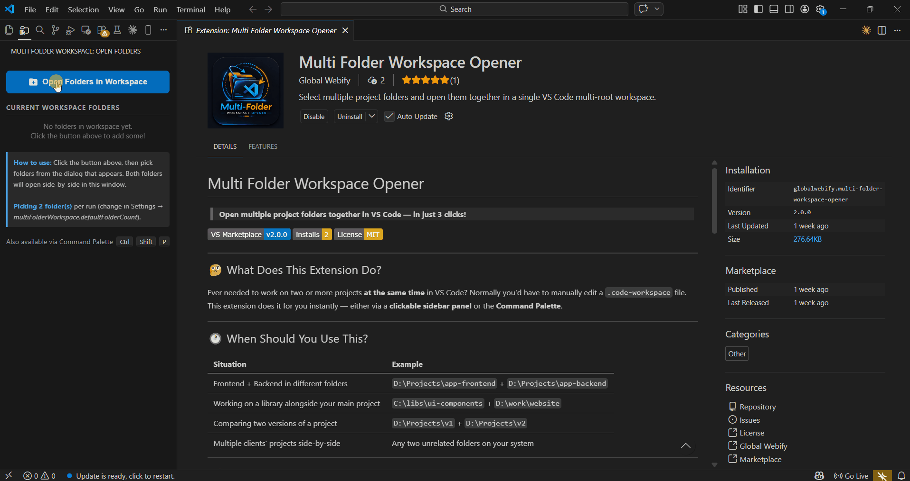

# Multi Folder Workspace Opener

Open multiple project folders together in VS Code in just a few clicks.

Multi Folder Workspace Opener helps developers quickly open two or more folders inside a single VS Code multi-root workspace without manually editing a `.code-workspace` file.

Perfect for full-stack development, microservices, and multi-project workflows.

[](https://marketplace.visualstudio.com/items?itemName=GlobalWebify.multi-folder-workspace-opener)
[](https://marketplace.visualstudio.com/items?itemName=GlobalWebify.multi-folder-workspace-opener)
[](LICENSE)

> ⭐ If this extension helps you, please consider leaving a rating on the [Marketplace](https://marketplace.visualstudio.com/items?itemName=GlobalWebify.multi-folder-workspace-opener).

---



---

## 🚀 Key Features

- Open multiple folders in one VS Code workspace
- Simple sidebar interface with one-click access
- Command palette support
- Automatically detect and skip duplicate folders
- Optional `.code-workspace` file saving
- Works with any type of project

---

## 💡 Common Use Cases

This extension is useful when working with:

| Scenario | Example |
|---|---|
| Frontend + Backend development | `app-frontend` + `app-backend` |
| Android app + API server | `mobile-app` + `api-server` |
| React + Laravel | `frontend` + `backend` |
| Comparing project versions | `project-v1` + `project-v2` |
| Multiple repositories | `repo1` + `repo2` |
| Working on a library alongside your main project | `ui-components` + `website` |

---

## ⚡ How to Use

### Method 1 — Sidebar (Recommended)

1. Click the extension icon in the Activity Bar (left side)
2. Click **Open Folders in Workspace**
3. Select your folders from the dialog

Done! Both folders will open in a single workspace.

---

### Method 2 — Command Palette

1. Press `Ctrl+Shift+P`
2. Search for **`Open Folders in Workspace`**
3. Select **Multi Folder Workspace: Open Folders in One Workspace**
4. Pick your folders from the dialogs

---

## 📂 Example Workspace Structure

```
EXPLORER
├── my-frontend
│   ├── src/
│   └── package.json
└── my-backend
    ├── src/
    └── package.json
```

You can now edit, search, run terminals, and manage both projects in one VS Code window.

---

## 💾 Save Workspace (Optional)

After selecting folders, you can save them as a `.code-workspace` file.

Benefits:

- Reopen the same projects instantly by double-clicking the file
- Share workspace setup with teammates
- Organize multi-project environments

---

## ⚙️ Settings

Go to **File → Preferences → Settings** and search **Multi Folder Workspace**:

| Setting | Default | Description |
|---|---|---|
| `defaultFolderCount` | `2` | Number of folders to select (2–10) |
| `autoSaveWorkspace` | `false` | Automatically save workspace file without prompting |

**Example — pick 3 folders at once:**

```json
{
  "multiFolderWorkspace.defaultFolderCount": 3
}
```

---

## 💡 Pro Tips

- **Reopen a saved workspace**: Double-click the `.code-workspace` file or use **File → Open Workspace from File…**
- **Add more folders later**: Run the command again — new folders are appended alongside existing ones
- **Duplicate protection**: Selecting the same folder twice is automatically skipped with a notification

---

## 🛠 Troubleshooting

| Problem | Solution |
|---|---|
| Sidebar not visible | Click the folder icon in the Activity Bar or reload VS Code |
| Command not found | Press `Ctrl+Shift+P` → **Reload Window** |
| Workspace not opening | Check if the folder paths still exist on your system |
| "Failed to add folders" error | Restart VS Code and try again |

---

## ❤️ Contributing

Found a bug or have a feature request?

👉 **[Open an issue on GitHub](https://github.com/websitedesigningstore/multi-folder-workspace-opener/issues)**

---

*Made with ❤️ by [GlobalWebify](https://globalwebify.com)*
